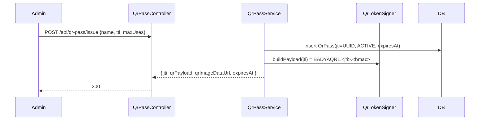

# Signed QR Pass — Scanning & Validation System

A standalone, production-grade module for issuing, scanning, and validating **HMAC-signed,
one-time-use QR passes**. It lives alongside the existing booking/attendance QR flow without changing
it, and is the reference implementation for secure QR validation in this project.

- **Backend module:** `backend/src/main/java/com/badyauniversity/eventbooking/qrpass/`
- **Scanner page:** `scan.html` / `scan.js` / `scan.css` (served at `/scan.html`)
- **Config:** `app.qrpass.*` in `application.properties` (secret via `QR_SIGNING_SECRET`)
- **Tables:** `qr_passes`, `qr_scan_audit`

---

## 1. Design principles

1. **Never trust the QR contents.** The QR carries only an opaque token id (`jti`) plus an HMAC
   signature. Every authoritative attribute — status, expiry, remaining uses, holder identity — is
   read from the database row, never from the scanned text.
2. **Sign everything.** The payload is `HMAC-SHA256`-signed with a server secret, so a forged or
   edited QR fails verification *before* any database lookup. Comparison is constant-time.
3. **Validate only on the server.** The scanner is a dumb client; all decisions happen in
   `QrPassService`.
4. **One-time use + replay-proof.** A pass has `max_uses` (default 1) and `use_count`. Validation runs
   in a transaction with a **row lock**, so two simultaneous scans can't both consume a one-time pass.
5. **Audit everything.** Every validation attempt — success or failure — writes a `qr_scan_audit` row.
6. **Rate-limit the gate.** `POST /api/qr-pass/validate` is throttled per client IP.

### Payload format
```
BADYAQR1.<base64url(jti)>.<base64url(HMAC_SHA256(secret, jti))>
```
`jti` is a random UUID. The prefix lets the scanner/verifier reject anything that isn't one of our
passes immediately.

### Status state-machine
```
            issue
              │
              ▼
          ┌────────┐  validate (uses left, not expired)   ┌──────┐
          │ ACTIVE │ ───────────────────────────────────▶ │ USED │
          └────────┘                                       └──────┘
              │  admin revoke
              ▼
          ┌─────────┐
          │ REVOKED │
          └─────────┘
Expiry is derived from expires_at at read time (no stored "EXPIRED" status).
Validation outcomes: VALID · INVALID · EXPIRED · ALREADY_USED · REVOKED
```

---

## 2. Architecture

```
┌──────────────────────┐         HTTPS          ┌─────────────────────────────────────────────┐
│  scan.html / scan.js  │  ───────────────────▶  │  QrPassController  (/api/qr-pass)            │
│  (html5-qrcode cam)   │   POST /validate       │    ├─ QrRateLimitFilter (per-IP, 429)        │
│  result screens       │ ◀───────────────────   │    ├─ QrTokenSigner   (HMAC verify, c-time)  │
└──────────────────────┘   { status, ... }       │    ├─ QrPassService   (state machine, lock)  │
                                                  │    │     ├─ QrPassRepository  (qr_passes)    │
   admin / server  ── POST /issue, /revoke ─────▶ │    │     └─ QrScanAuditRepository (audit)    │
                                                  │    └─ QrCodeService   (ZXing PNG)            │
                                                  └─────────────────────────────────────────────┘
                                                                    │
                                                            H2 (dev) / MySQL (prod)
```

**Files**
| Layer | File |
|---|---|
| Enum | `qrpass/model/ValidationStatus.java` |
| Entities | `qrpass/model/QrPass.java`, `qrpass/model/QrScanAudit.java` |
| Repos | `qrpass/repository/QrPassRepository.java` (+ locked finder), `qrpass/repository/QrScanAuditRepository.java` |
| DTOs | `qrpass/dto/{IssuePassRequest,IssuePassResponse,ValidateRequest,ValidateResponse}.java` |
| Signing | `qrpass/service/QrTokenSigner.java` |
| Core logic | `qrpass/service/QrPassService.java` |
| Config | `qrpass/config/QrPassProperties.java`, `qrpass/config/QrRateLimitFilter.java` |
| API | `qrpass/web/QrPassController.java` |
| QR image (reused) | `service/QrCodeService.java` |

---

## 3. Sequence diagrams

### Issue


### Validate (all outcomes)
```mermaid
sequenceDiagram
    participant Scanner
    participant RL as RateLimitFilter
    participant API as QrPassController
    participant Sign as QrTokenSigner
    participant Svc as QrPassService
    participant DB
    Scanner->>RL: POST /api/qr-pass/validate {payload}
    alt over limit
        RL-->>Scanner: 429 RATE_LIMITED
    else allowed
        RL->>API: forward
        API->>Sign: verifyAndExtractJti(payload)
        alt bad/edited signature
            Sign-->>API: null
            API->>DB: audit(INVALID)
            API-->>Scanner: { status: INVALID }
        else signature ok
            API->>Svc: validate(jti)
            Svc->>DB: SELECT ... FOR UPDATE by jti
            alt not found
                Svc->>DB: audit(INVALID) ; returns INVALID
            else revoked
                Svc->>DB: audit(REVOKED) ; returns REVOKED
            else expired
                Svc->>DB: audit(EXPIRED) ; returns EXPIRED
            else already used up
                Svc->>DB: audit(ALREADY_USED) ; returns ALREADY_USED
            else consumable
                Svc->>DB: use_count++, set USED if exhausted ; audit(VALID)
                Svc-->>API: VALID + holder details
            end
            API-->>Scanner: { status, name, subject, ... }
        end
    end
```

### Revoke
```mermaid
sequenceDiagram
    participant Admin
    participant API as QrPassController
    participant DB
    Admin->>API: POST /api/qr-pass/{jti}/revoke
    API->>DB: SELECT ... FOR UPDATE ; status = REVOKED
    API-->>Admin: { revoked: true }
```

---

## 4. Database design

### `qr_passes`
| Column | Type | Notes |
|---|---|---|
| id | BIGINT PK | |
| jti | VARCHAR(64) | **UNIQUE** — token id embedded in the QR |
| subject_type / subject_id | VARCHAR | what the pass grants (e.g. TICKET/booking id) |
| name / email | VARCHAR | optional holder details (shown on result) |
| status | VARCHAR(20) | ACTIVE / USED / REVOKED |
| issued_at / expires_at / used_at | DATETIME(6) | expiry drives EXPIRED at read time |
| used_by | VARCHAR | last operator who consumed/revoked |
| max_uses / use_count | INT | one-time = 1; replay-proof counter |

Indexes: `uq_qr_passes_jti` (unique), `idx_qr_passes_status`, `idx_qr_passes_expires`.

### `qr_scan_audit`
| Column | Type | Notes |
|---|---|---|
| id | BIGINT PK | |
| created_at | DATETIME(6) | when the attempt happened |
| jti | VARCHAR(64) | token id if extractable (null for unsigned garbage) |
| result | VARCHAR(20) | VALID / INVALID / EXPIRED / ALREADY_USED / REVOKED |
| ip / user_agent / scanned_by | VARCHAR | request origin + operator |

Indexes: `idx_qr_scan_audit_jti`, `idx_qr_scan_audit_created`. Full DDL is in `database_schema.sql`
(Hibernate `ddl-auto=update` also creates them automatically).

---

## 5. API documentation

Base URL `…/api/qr-pass`. All bodies are JSON.

### `POST /issue`
Issue a signed pass.
```jsonc
// request (all optional)
{ "subjectType": "TICKET", "subjectId": "42", "name": "Adham", "email": "a@x.com",
  "ttlSeconds": 86400, "maxUses": 1 }
// 200
{ "jti": "f1c2…", "qrPayload": "BADYAQR1.…", "qrImageDataUrl": "data:image/png;base64,…",
  "expiresAt": "2026-06-16T09:00:00Z" }
```

### `POST /validate`  *(rate-limited, audited)*
Validate a scanned payload. Always returns **200** with the outcome in `status`.
```jsonc
// request
{ "payload": "BADYAQR1.…", "scannedBy": "gate-1" }
// 200
{ "status": "VALID", "message": "Pass verified.", "name": "Adham",
  "subjectType": "TICKET", "subjectId": "42", "expiresAt": "…", "usedAt": "…" }
// 429 when over the per-IP limit
{ "status": "RATE_LIMITED", "message": "Too many scan attempts. Please slow down." }
```
`status` ∈ `VALID | INVALID | EXPIRED | ALREADY_USED | REVOKED`.

### `POST /{jti}/revoke`
```jsonc
// optional body { "revokedBy": "admin" }
{ "jti": "f1c2…", "revoked": true }   // 404 if not found
```

### `GET /{jti}`
Current pass status (admin).
```jsonc
{ "jti": "f1c2…", "status": "ACTIVE", "subjectType": "TICKET", "useCount": 0, "maxUses": 1,
  "issuedAt": "…", "expiresAt": "…", "usedAt": null }
```

### `GET /audit`
Last 100 scan attempts, newest first (admin).

---

## 6. Security considerations & checklist

- [x] **Never trust QR data** — only `jti` + signature travel in the QR; all attributes come from DB.
- [x] **HMAC-SHA256 signed** payloads; forged/edited QR rejected before any DB hit.
- [x] **Constant-time** signature comparison (`MessageDigest.isEqual`) — no timing oracle.
- [x] **Server-side validation only**; the client renders the returned status.
- [x] **One-time use** via `max_uses`/`use_count`; **replay-proof** via a `SELECT … FOR UPDATE` row
      lock so concurrent scans can't double-spend.
- [x] **Revocation** supported (instant `REVOKED`).
- [x] **Expiry** enforced from `expires_at` at read time.
- [x] **Rate limiting** per IP on `/validate` → `429`.
- [x] **Full audit log** of every attempt (jti, result, ip, user-agent, operator).
- [x] **Secret management** via `QR_SIGNING_SECRET`; loud startup warning on the dev default.
- [ ] **TLS in production** — terminate HTTPS in front (the payload + result must not travel cleartext).
- [ ] **AuthN/AuthZ on issue/revoke/audit** — these are admin actions; today they inherit the app's
      (minimal) auth model. Put them behind an authenticated admin role before production
      (see the project `AUDIT_REPORT.md`, C-1/C-2).
- [ ] **Secret rotation** — support a key id + multiple active keys if you rotate the HMAC secret.

---

## 7. Scalability

- **Validation is O(1):** one indexed lookup on `jti` (unique) + one update. Scales horizontally;
  the only shared state is the database.
- **Rate limiter is in-memory per instance.** For a multi-instance deployment move it to a shared
  store (Redis `INCR`/`EXPIRE`, or a token-bucket like Bucket4j-Redis) so the limit is global.
- **Audit growth:** `qr_scan_audit` grows with every scan. Add time-based partitioning / archival and
  retention (e.g. ship to cold storage after N months); the `created_at` index supports range purges.
- **Hot reads:** if you ever validate the same pass repeatedly (multi-use turnstiles), a short-TTL
  cache of pass metadata can offload the DB, but the *consume* step must still hit the locked row.
- **QR image rendering** is CPU-bound (ZXing); render at issue time and cache/store the data URL
  rather than regenerating per request.

---

## 8. Testing strategy

- **Unit/integration (implemented):** `backend/src/test/.../qrpass/QrPassServiceTest.java` (Spring Boot
  + H2) covers the state machine end-to-end:
  - issue → validate = `VALID`; replay → `ALREADY_USED`
  - tampered signature → `INVALID` (and the pass is *not* consumed)
  - expired pass → `EXPIRED`
  - revoked pass → `REVOKED`
  - multi-use pass honors `max_uses`
  - one audit row written per attempt
- **Recommended next:**
  - `QrTokenSigner` unit tests (round-trip, wrong key, malformed segments).
  - Web-layer test (`@WebMvcTest`) for status codes + the `429` rate-limit path.
  - Concurrency test: fire N parallel `validate` calls at a one-time pass; assert exactly one `VALID`.
  - Frontend: manual matrix on desktop + mobile (camera allow/deny, each result screen, retry).

Run: `mvn -f backend/pom.xml test`.

---

## 9. Setup & try it

1. Set a real secret (optional in dev): `export QR_SIGNING_SECRET="$(openssl rand -hex 32)"`.
2. Start the app (`./run_project.sh`).
3. Open `http://localhost:5000/scan.html` → expand **“Issue a test pass”** → **Issue & show QR** →
   **Start camera** → scan it → green **Valid**; scan again → blue **Already used**.
4. Or via curl — see the verification block in the project plan / below:
```bash
B=http://localhost:5000
P=$(curl -s -X POST $B/api/qr-pass/issue -H 'Content-Type: application/json' \
      -d '{"name":"Demo","subjectType":"ACCESS"}' | python3 -c 'import sys,json;print(json.load(sys.stdin)["qrPayload"])')
curl -s -X POST $B/api/qr-pass/validate -H 'Content-Type: application/json' -d "{\"payload\":\"$P\"}"  # VALID
curl -s -X POST $B/api/qr-pass/validate -H 'Content-Type: application/json' -d "{\"payload\":\"$P\"}"  # ALREADY_USED
```
